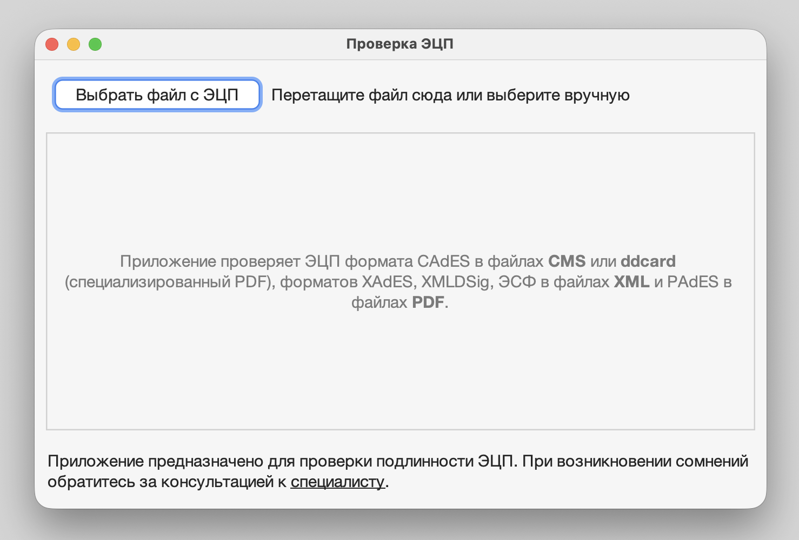

# EDScheck

Десктопное приложение для предварительной проверки электронной цифровой подписи (ЭЦП) в CMS-контейнерах и Карточках электронного документа PDF (`ddcard`) по законодательству Республики Казахстан.

> **ВНИМАНИЕ!** Приложение предназначено для предварительной проверки документов. При возникновении сомнений обратитесь за консультацией к [специалисту](https://sigex.kz/blog/2021-01-25-digital-signatures-in-courts/#where-to-find-experts).

<p align="center">
  <picture>
    <source media="(prefers-color-scheme: dark)" srcset="assets/screenshot-dark.png">
    
  </picture>
</p>

## Что делает приложение

- Выбор файла кнопкой или перетаскиванием на окно.
- Attached CMS и [Карточки электронного документа](https://github.com/kaarkz/ddcard) проверяются сразу.
- Detached CMS (подпись отдельно от документа) приложение распознаёт само и запросит второй файл — сам подписываемый документ.
- Панель ошибок показывает причину, если файл не подходит для проверки.
- Светлая/тёмная тема — под системную, с автопереключением на лету.

Криптографию выполняет сертифицированная библиотека **KalkanCrypt** (сертификат KZ.7500507.05.01.40731) — сама библиотека **НЕ входит ни в этот репозиторий, ни в скачиваемое приложение**, но запросить её может любой желающий (см. «Первый запуск» ниже или шаг 2 для сборки из исходников).

## Установка

[**Последняя версия**](https://github.com/vturekhanov/edscheck-desktop/releases/latest) — macOS 11 (Big Sur) или новее (только для процессоров Apple Silicon).

Скачайте файл `EDScheck-<версия>-macos-arm64.dmg`, откройте его и перетащите приложение в «Программы». Приложение подписано Developer ID и заверено (нотаризовано) Apple.

Для Linux и Windows приложение пока собирается только из исходников (см. ниже).

### Первый запуск

При первом запуске приложение откроет окно с просьбой перетащить в него файл библиотеки — `kalkancrypt-0.7.6-certified.jar` из SDK, который выдаёт НУЦ РК (папка `SDK 2.0\Java\provider`). [Запросить SDK](https://sdk.pki.gov.kz) может любой желающий.

Приложение сохранит библиотеку у себя, и дальше будет запускаться обычным образом. Принимается именно эта версия библиотеки: её контрольная сумма проверяется при каждом запуске.

## Сборка из исходников

**Уже есть JDK 21 (или новее) на машине?** Копировать/распаковывать в `.jdk/` необязательно — сборочные и запускающие скрипты сами ищут JDK по приоритету: `.jdk/` (портативный, если положили) → `$JAVA_HOME`/`%JAVA_HOME%` (если задан) → `javac`/`java` из `PATH`. Явных `--release`/`-source` ограничений в коде нет, нужна только версия 21 или новее.

Требуется интернет-доступ для шага 1.

### 1. Портативный JDK 21

#### macOS (Apple Silicon)
```sh
mkdir -p .jdk
curl -fL -o /tmp/temurin21.tar.gz "https://api.adoptium.net/v3/binary/latest/21/ga/mac/aarch64/jdk/hotspot/normal/eclipse?project=jdk"
tar -xzf /tmp/temurin21.tar.gz -C .jdk --strip-components=3
.jdk/bin/java -version   # ожидается Temurin-21.x.x (LTS)
```

#### Linux (x64)
```sh
mkdir -p .jdk
curl -fL -o /tmp/temurin21.tar.gz "https://api.adoptium.net/v3/binary/latest/21/ga/linux/x64/jdk/hotspot/normal/eclipse?project=jdk"
tar -xzf /tmp/temurin21.tar.gz -C .jdk --strip-components=1
.jdk/bin/java -version   # ожидается Temurin-21.x.x (LTS)
```

#### Windows (x64)

Скачайте zip-архив [Temurin 21 для Windows x64](https://api.adoptium.net/v3/binary/latest/21/ga/windows/x64/jdk/hotspot/normal/eclipse?project=jdk) и распакуйте в `.jdk\` в корне репозитория так, чтобы получился путь `.jdk\bin\java.exe` (архив, как и на macOS, может быть вложен на один уровень глубже — при необходимости переместите содержимое вложенной папки на уровень выше).

### 2. KalkanCrypt JCE-провайдер

Сертифицированный jar НЕ публикуется в этом репозитории. [Запросить](https://sdk.pki.gov.kz) его можно у Национального удостоверяющего центра Республики Казахстан (НУЦ РК).

Нужный файл находится в папке `SDK 2.0\Java\provider` SDK, который выдаёт НУЦ РК. Его нужно положить **строго под этим именем** в папку `lib` репозитория, рядом с другими библиотеками:

```
kalkancrypt-0.7.6-certified.jar
```

Сборочные и запускающие скрипты (и `.sh`, и `.bat`) ищут этот путь буквально — без него сборка/запуск не заработают.

### 3. Собрать и запустить

#### macOS

Запустите только **один раз**, если раньше не устанавливались Xcode Command Line Tools. Нужны для build-macos-arm64.sh — он вызывает нативные утилиты macOS (codesign, pkgbuild, hdiutil, sips, iconutil), которых нет на чистой системе без этого пакета.
```sh
xcode-select --install
```

Запустите после установки Xcode Command Line Tools.
```sh
./build-macos-arm64.sh
```

Если всё пройдёт хорошо, готовое приложение будет лежать в папке `dist`.

Если по каким-то причинам хотите обойтись без установки Xcode Command Line Tools, просто выполните команды для Linux (см. ниже). Под macOS они тоже сработают.

#### Linux
```sh
./build.sh && ./build-gui.sh
bin/EDScheck
```

#### Windows
```bat
build.bat
build-gui.bat
bin\EDScheck.bat
```

`.bat`-скрипты  написаны по образцу `build.sh`/`build-gui.sh`/`bin/EDScheck`. Сообщения в них на английском: версия с русским текстом ломала разбор всего файла целиком.

## Лицензия

GPL-3.0 — полный текст в [`LICENSE`](LICENSE), с дополнительным разрешением
на связывание с KalkanCrypt (GPLv3 §7) — [`LICENSE-EXCEPTION`](LICENSE-EXCEPTION).
